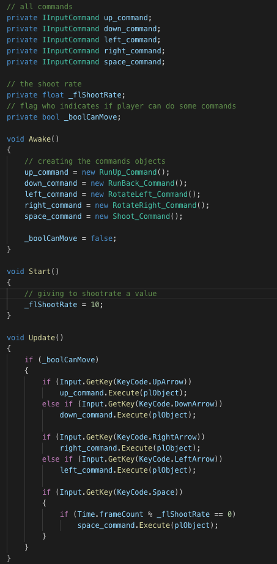

# Command pattern example for C# and Unity
Example of mapping player movement commands with this pattern

## Description
Command pattern definition: *"encapsulate a request as an object, thereby letting you parameterize clients with different requests, queue or log requests, and support undoable operations"*.

One of the uses of this pattern is **controller mapping** so let's see how we can apply it into our game.

## Getting started
For this example I will use three classes: *Player*, *InputCommands* and *ExecuteInputs*.

Class **Player** contains the basic movement functions for a third person character movement:

The file InputCommands.cs has the interface **IInputCommand** which defines the function *Execute* to all classes who want to implement it, so every command will implement this function passing the *Player* object as parameter which is in charge to execute its own functions:

And finally the **ExecuteCommands** class is in charge to trigger the commands that player is pressing, so will have all the IInpuntCommands implementations related with an input key:

